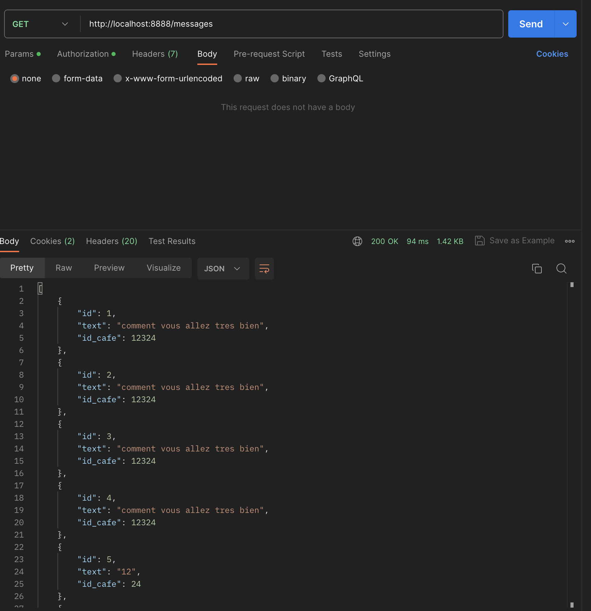
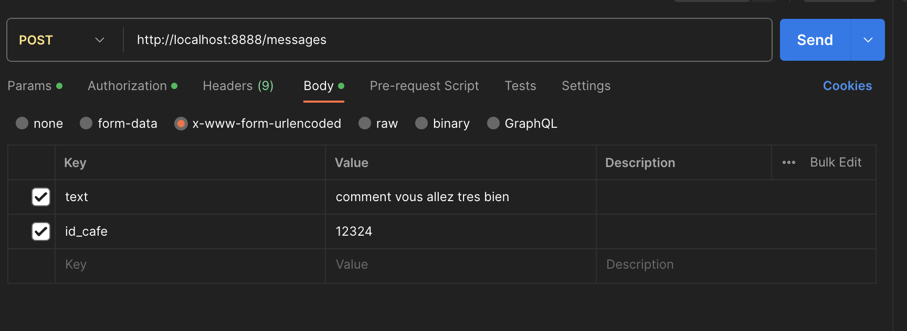
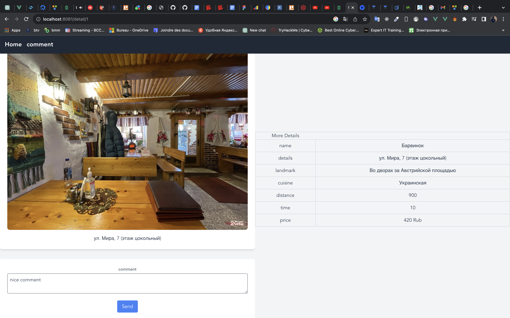
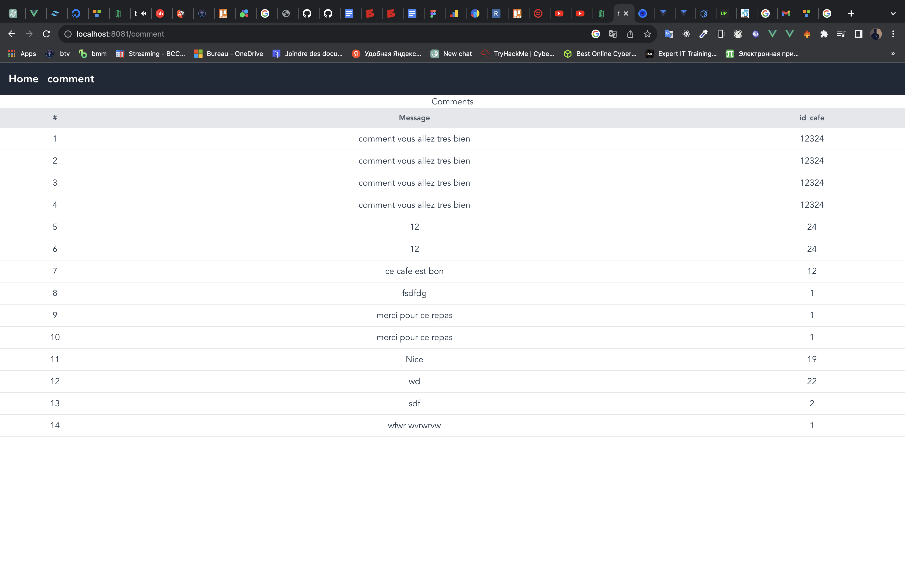

#clone the project

```
git clone  https://github.com/THISmann/message-api-2

```


```
cd message-api
```

#Setup you database

```
cd/config/db.php

  'dsn' => 'mysql:host=localhost;dbname=you_db',
    'username' => 'user',
    'password' => 'password',

```

#install composer on you server

#run the php yii serve

```
php yii serve --port 8888
```

#open postman




#start the project

```
cd ..
cd front-end
npm install
npm run serve

```





